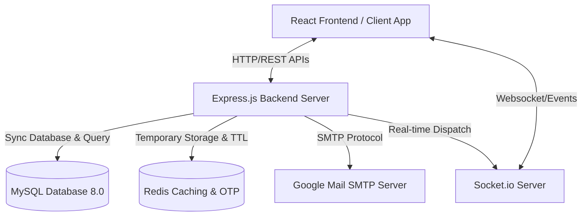
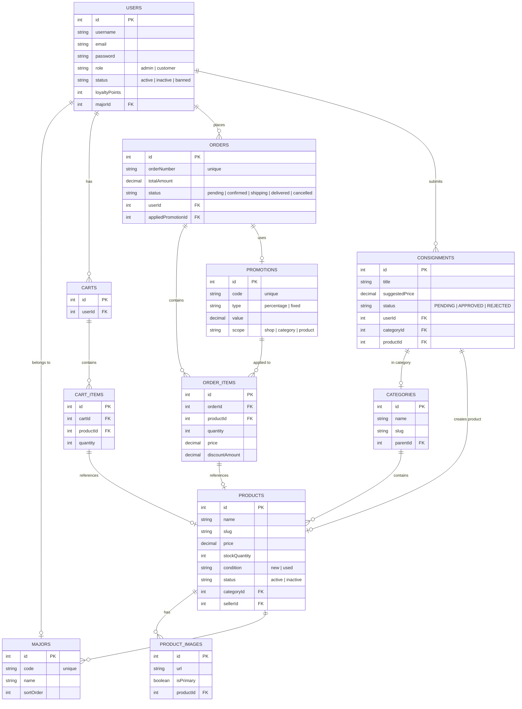
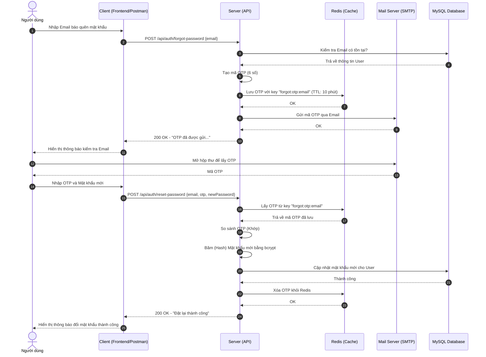
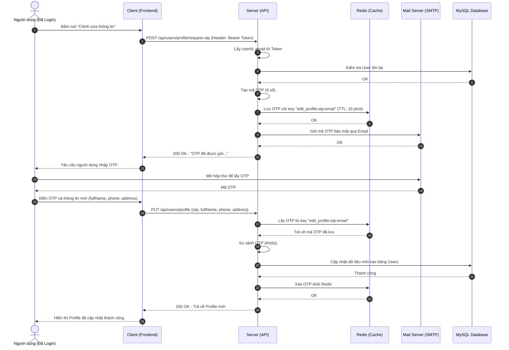

# UTEShop - Nền tảng Thương mại Điện tử chuyên biệt dành cho Sinh viên HCMUTE

**UTEShop** là một hệ thống thương mại điện tử đồng bộ từ Backend đến Frontend, được phát triển nhằm mục tiêu giải quyết các nhu cầu thiết thực của cộng đồng sinh viên Trường Đại học Sư phạm Kỹ thuật TP.HCM (HCMUTE). Hệ thống tích hợp các tính năng mua sắm sản phẩm chuyên ngành, hàng lưu niệm và đặc biệt hỗ trợ quy trình **ký gửi và thanh lý đồ cũ** giúp tối ưu hóa chi phí và tài nguyên học tập.

---

## 👥 Thành viên thực hiện dự án (Team Members)
*   **Nguyễn Nhật Huy** - MSSV: **23110226** (Vai trò: Lập trình viên Backend & Frontend, Thiết kế CSDL, Quản lý Hệ thống)
*   **Đặng Ngọc Tài** - MSSV: **23110304** (Vai trò: Lập trình viên Backend & Frontend, Tối ưu hóa UI/UX, Quản lý Hệ thống)

---

## 🏗️ Tổng quan kiến trúc hệ thống (System Architecture)

Sơ đồ dưới đây mô tả cách các thành phần trong hệ thống tương tác qua lại:



---

## 🛠️ Công nghệ sử dụng chi tiết (Detailed Tech Stack)

| Thành phần | Công nghệ / Thư viện | Vai trò & Ứng dụng cụ thể |
| :--- | :--- | :--- |
| **Frontend UI** | **React 19 & TypeScript** | Xây dựng giao diện ứng dụng phía Client theo mô hình SPA (Single Page Application). |
| | **TailwindCSS v4** | Sử dụng hệ thống tiện ích CSS hiện đại nhất để thiết kế giao diện responsive linh hoạt và nhanh chóng. |
| **State & Routes** | **Redux Toolkit** | Quản lý trạng thái toàn cục (Giỏ hàng, trạng thái đăng nhập của người dùng, sản phẩm yêu thích). |
| | **React Router DOM v7**| Phân tuyến ứng dụng, hỗ trợ bảo vệ các route cần đăng nhập hoặc route dành riêng cho Admin. |
| **Network & Events**| **Axios** | Gửi request lên Backend API. Tích hợp interceptors để tự động gửi JWT và gọi refresh token khi token hết hạn. |
| | **Socket.io-client** | Kết nối kênh WebSocket để nhận thông báo đẩy thời gian thực và chat hỗ trợ. |
| **Backend Server** | **Node.js & Express.js** | Xây dựng RESTful API Server, xử lý routing, phân quyền và triển khai các middleware nghiệp vụ. |
| **Database ORM** | **Sequelize (MySQL)** | Tạo lập, liên kết các bảng CSDL và tối ưu hóa các câu lệnh truy vấn dữ liệu SQL. |
| **Cache & OTP** | **Redis** | Lưu trữ mã OTP đăng ký/quên mật khẩu/cập nhật profile với cơ chế TTL tự động xóa, chống spam OTP. |
| **Realtime** | **Socket.io** | Quản lý vòng đời kết nối thời gian thực, gửi thông báo cá nhân hóa (`user:id`) và thông báo quản trị (`admins`). |
| **Mailing** | **Nodemailer** | Kết nối SMTP Server gửi email HTML đẹp chứa OTP, nội dung cập nhật trạng thái tới hòm thư người dùng. |
| **Security** | **JWT & BcryptJS** | Phát hành mã thông báo đăng nhập Access Token (chứa trong bộ nhớ tạm Client) và Refresh Token (lưu Cookie HttpOnly). Mã hóa mật khẩu bằng bcrypt. |

---

## 📂 Tổ chức mã nguồn của dự án (Project Directory Structure)

### 1. Cấu trúc Backend (`/`)
```text
UTEShop/
├── docker-compose.yml     # Cấu hình container MySQL, Redis và dịch vụ Seed
├── package.json           # Các thư viện và script chạy backend
├── .env.example           # Tệp cấu hình môi trường mẫu
├── src/
│   ├── app.js             # Khởi tạo Express app, cấu hình CORS, parser, và nạp router
│   ├── server.js          # Khởi động kết nối MySQL, Redis, Socket.io và kích hoạt Scheduler
│   ├── config/            # Cấu hình kết nối MySQL (db.js) và Redis (redis.js)
│   ├── controllers/       # Điều phối yêu cầu, xử lý phản hồi HTTP (auth, user, admin, catalog...)
│   ├── middlewares/       # Bộ lọc kiểm tra Token, quyền hạn, xử lý lỗi tập trung, giỏ hàng, rate limit
│   ├── models/            # Định nghĩa các Model Sequelize và thiết lập mối quan hệ trong index.js
│   ├── routes/            # Khai báo các đường dẫn API tương ứng với từng phân hệ chức năng
│   ├── scripts/           # Các script bổ trợ nhà phát triển (ví dụ: xem nhanh OTP trong Redis)
│   ├── seeders/           # Các tệp script nạp dữ liệu giả lập ban đầu cho MySQL
│   ├── services/          # Chứa logic nghiệp vụ cốt lõi (xử lý đơn hàng, ký gửi, gửi mail, socket...)
│   ├── utils/             # Các hàm tiện ích (chuẩn hóa dữ liệu, đảm bảo cập nhật schema cơ sở dữ liệu)
│   └── validators/        # Các bộ quy tắc kiểm tra tính hợp lệ của dữ liệu đầu vào (express-validator)
```

### 2. Cấu trúc Frontend (`/frontend`)
```text
frontend/
├── index.html             # Tệp HTML gốc
├── package.json           # Thư viện và script chạy frontend
├── vite.config.ts         # Cấu hình máy chủ phát triển Vite
├── tsconfig.json          # Cấu hình TypeScript
├── src/
│   ├── main.tsx           # Điểm khởi tạo React DOM
│   ├── App.tsx            # Cấu hình các Route bảo mật, tuyến ứng dụng chính
│   ├── index.css          # Nạp TailwindCSS và định nghĩa thiết kế hệ thống
│   ├── components/        # Các thành phần tái sử dụng (Navbar, Footer, Modal, ProductCard...)
│   ├── context/           # React Context quản lý Socket connection, Notifications
│   ├── hooks/             # Custom React hooks tối ưu logic component
│   ├── pages/             # Các trang giao diện (Trang chủ, Chi tiết, Ký gửi, Giỏ hàng, Admin Dashboard...)
│   ├── services/          # Các tệp gọi API Backend kết nối qua Axios và xử lý Session
│   ├── store/             # Cấu hình Redux Store và các Redux Slices (cartSlice, authSlice...)
│   ├── types/             # Định nghĩa kiểu dữ liệu TypeScript (Product, User, Order...)
│   └── utils/             # Tiện ích chuyển đổi định dạng tiền tệ, mappers, quản lý lưu trữ giỏ hàng
```

---

## 🗄️ Kiến trúc Cơ sở Dữ liệu (Database Schema ERD)

Dưới đây là sơ đồ quan hệ giữa các thực thể cốt lõi trong hệ thống UTEShop:



---

## 🔌 Chi tiết danh sách API Endpoints (API Routes Document)

### 1. Phân hệ Xác thực (Authentication)
*   `POST /api/auth/register` : Đăng ký tài khoản (Tạo tài khoản trạng thái `inactive` và lưu mã OTP vào Redis).
*   `POST /api/auth/verify-email` : Kích hoạt tài khoản bằng mã OTP gửi qua Email.
*   `POST /api/auth/resend-otp` : Gửi lại OTP kích hoạt (Giới hạn tối đa 3 lần/giờ).
*   `POST /api/auth/login` : Đăng nhập nhận JWT. Lưu Access Token trong bộ nhớ client, Refresh Token trong HttpOnly Cookie.
*   `POST /api/auth/refresh` : Sử dụng Refresh Token để làm mới Access Token khi hết hạn.
*   `POST /api/auth/forgot-password` : Yêu cầu khôi phục mật khẩu (Gửi mã OTP 6 số qua email).
*   `POST /api/auth/reset-password` : Xác nhận mã OTP và đặt lại mật khẩu mới.

### 2. Phân hệ Người dùng & Cá nhân (User Profile)
*   `GET /api/users/me` : Lấy thông tin tài khoản hiện tại (Yêu cầu Token).
*   `POST /api/users/profile/request-otp` : Yêu cầu OTP để chỉnh sửa thông tin cá nhân.
*   `PUT /api/users/profile` : Xác thực OTP và cập nhật profile (Họ tên, SĐT, Địa chỉ).
*   `POST /api/users/profile/change-password/request-otp` : Yêu cầu OTP để đổi mật khẩu.
*   `PUT /api/users/profile/change-password` : Đổi mật khẩu mới (Xác thực qua OTP và Mật khẩu cũ).
*   `GET /api/users/me/orders` : Danh sách đơn hàng cá nhân.
*   `GET /api/users/me/points` : Xem số điểm loyalty tích lũy và lịch sử biến động điểm.
*   `GET /api/users/me/addresses` : Xem danh sách địa chỉ nhận hàng cá nhân.
*   `POST /api/users/me/addresses` : Thêm mới địa chỉ nhận hàng.
*   `PUT /api/users/me/addresses/:id/default` : Đặt địa chỉ làm mặc định.
*   `DELETE /api/users/me/addresses/:id` : Xóa địa chỉ nhận hàng.

### 3. Phân hệ Danh mục & Sản phẩm (Catalog)
*   `GET /api/catalog/home` : Lấy thông tin trang chủ (Banner đang chạy, danh mục, sản phẩm nổi bật, sản phẩm mới, bán chạy nhất).
*   `GET /api/catalog/majors` : Lấy danh sách ngành học của HCMUTE.
*   `GET /api/catalog/categories` : Lấy danh sách danh mục và số lượng sản phẩm liên kết.
*   `GET /api/catalog/products` : Lấy danh sách sản phẩm (Hỗ trợ tìm kiếm theo từ khóa `q`, lọc theo `category`, lọc theo `majorId`, sắp xếp theo giá/độ phổ biến, và phân trang).
*   `GET /api/catalog/products/:slug` : Xem chi tiết sản phẩm và các sản phẩm tương tự cùng danh mục.

### 4. Phân hệ Giỏ hàng & Thanh toán (Cart & Checkout)
*   `GET /api/cart` : Lấy giỏ hàng hiện tại (hỗ trợ cả tài khoản khách vãng lai thông qua Cart Context).
*   `POST /api/cart/items` : Thêm sản phẩm hoặc biến thể vào giỏ hàng.
*   `PUT /api/cart/items/:itemId` : Cập nhật số lượng của mặt hàng trong giỏ hàng.
*   `DELETE /api/cart/items/:itemId` : Xóa mặt hàng khỏi giỏ hàng.
*   `POST /api/cart/merge` : Đồng bộ giỏ hàng từ máy cá nhân lên tài khoản sau khi đăng nhập.
*   `POST /api/checkout/preview` : Xem thử hóa đơn thanh toán (Tính tổng tiền, áp dụng khuyến mãi, tính số điểm tích lũy nhận được).
*   `POST /api/checkout/place-order` : Tiến hành đặt hàng (Hỗ trợ COD hoặc thanh toán bằng Điểm thưởng).
*   `POST /api/checkout/orders/:orderNumber/cancel` : Người dùng gửi yêu cầu hủy đơn hàng.
*   `POST /api/checkout/orders/:orderNumber/return` : Người dùng gửi yêu cầu hoàn trả đơn hàng.

### 5. Phân hệ Ký gửi (Consignment)
*   `GET /api/users/me/consignments` : Xem lịch sử các yêu cầu ký gửi đồ cũ của cá nhân.
*   `GET /api/users/me/consignments/form-options` : Lấy danh sách danh mục phục vụ biểu mẫu ký gửi.
*   `POST /api/users/me/consignments` : Tạo yêu cầu ký gửi sản phẩm thanh lý mới (Kèm mô tả, hình ảnh và giá đề xuất).
*   `PUT /api/users/me/consignments/:id` : Sửa đổi thông tin yêu cầu ký gửi (Chỉ thực hiện được khi yêu cầu ở trạng thái `PENDING`).
*   `DELETE /api/users/me/consignments/:id` : Hủy/Xóa yêu cầu ký gửi đang chờ duyệt.

### 6. Phân hệ Quản trị viên (Admin Routes)
*   `GET /api/admin/dashboard` : Xem báo cáo, biểu đồ thống kê hệ thống.
*   `GET /api/admin/orders` : Danh sách tất cả đơn hàng toàn hệ thống (Hỗ trợ lọc theo trạng thái).
*   `PATCH /api/admin/orders/:orderNumber/status` : Thay đổi trạng thái đơn hàng (Chuẩn bị, Giao hàng, Xác nhận hủy/hoàn tiền).
*   `POST /api/admin/products` : Thêm mới sản phẩm hệ thống hoặc đưa sản phẩm mới vào kho.
*   `PATCH /api/admin/products/:id` : Sửa đổi thông tin sản phẩm hệ thống.
*   `DELETE /api/admin/products/:id` : Xóa sản phẩm hệ thống.
*   `GET /api/admin/consignments` : Danh sách tất cả yêu cầu ký gửi của sinh viên.
*   `PATCH /api/admin/consignments/:id` : Xét duyệt yêu cầu ký gửi (Chuyển đổi trạng thái sang `APPROVED` hoặc `REJECTED`). Khi phê duyệt, sản phẩm sẽ tự động hiển thị công khai trên sàn dưới dạng sản phẩm đã qua sử dụng.
*   `GET /api/admin/users` : Quản lý thông tin và vai trò của người dùng trong hệ thống.
*   `PUT /api/admin/users/:id/status` : Khóa (Banned) hoặc kích hoạt lại tài khoản người dùng. Khi khóa tài khoản, tất cả kết nối Socket đang hoạt động của người dùng đó sẽ bị buộc ngắt kết nối lập tức.

---

## 🗺️ Quy trình nghiệp vụ cốt lõi (Core Business Workflows)

### 1. Luồng khôi phục mật khẩu (Forgot Password)



### 2. Luồng cập nhật thông tin cá nhân có mã xác nhận (Update Profile)



---

## ⚙️ Cấu hình môi trường cụ thể (Detailed Environment Setup)

Để chạy dự án cục bộ, bạn cần thiết lập tệp `.env` dựa trên tệp `.env.example` mẫu:

```bash
cp .env.example .env
```

### Giải thích các tham số cấu hình:

#### 1. Hệ thống Server
*   `PORT=3000`: Cổng hoạt động của API Backend.
*   `NODE_ENV=development`: Môi trường chạy dự án (`development` hoặc `production`).

#### 2. Kết nối MySQL (Docker / Local)
*   `DB_HOST=localhost`: Địa chỉ máy chủ MySQL (dùng `mysql` khi chạy nội bộ trong Docker Network).
*   `DB_PORT=3306`: Cổng kết nối cơ sở dữ liệu MySQL.
*   `DB_USER=root`: Tên tài khoản MySQL.
*   `DB_PASSWORD=123456`: Mật khẩu tài khoản MySQL.
*   `DB_NAME=uteshop_db`: Tên cơ sở dữ liệu sẽ tự động tạo lập.

#### 3. Kết nối Redis (Docker / Local)
*   `REDIS_HOST=localhost`: Địa chỉ máy chủ Redis (dùng `redis` trong mạng Docker).
*   `REDIS_PORT=6379`: Cổng kết nối Redis.
*   `REDIS_PASSWORD=redis_password`: Mật khẩu bảo vệ của Redis.

#### 4. Khóa bảo mật JSON Web Token (JWT)
*   `JWT_ACCESS_SECRET`: Khóa ký số Token truy cập ngắn hạn (Access Token).
*   `JWT_REFRESH_SECRET`: Khóa ký số Token làm mới dài hạn (Refresh Token).
*   `JWT_ACCESS_EXPIRATION=15m`: Thời gian sống của Access Token (Mặc định 15 phút).
*   `JWT_REFRESH_EXPIRATION=7d`: Thời gian sống của Refresh Token (Mặc định 7 ngày).

#### 5. Cấu hình gửi Mail OTP (SMTP Gmail)
*   `OTP_DEV_CONSOLE=true`: Chế độ phát triển nhanh. Khi bật `true`, mã OTP sẽ **không thực hiện gửi Gmail** mà được **in thẳng ra màn hình Terminal chạy Server API** để bạn phát triển nhanh mà không cần SMTP.
*   `MAIL_TRANSPORT=gmail`: Sử dụng trình gửi email mặc định cho Gmail.
*   `MAIL_USER=your_email@gmail.com`: Tài khoản email gửi.
*   `MAIL_PASS=your_app_password_16_characters`: Mật khẩu ứng dụng gồm 16 ký tự được tạo trong thiết lập bảo mật Tài khoản Google (Xác minh 2 bước -> Mật khẩu ứng dụng). *Không dùng mật khẩu đăng nhập thông thường.*

---

## 🚀 Hướng dẫn khởi chạy hệ thống (How to Run System)

### Cách 1: Chạy bằng Docker Compose (Khuyên dùng)
Phương pháp này giúp cài đặt nhanh MySQL 8.0 và Redis 7.0 trên Docker, tự động chạy Seeder nạp dữ liệu mẫu ban đầu:

1.  **Chạy các cơ sở dữ liệu và cache**:
    ```bash
    npm run docker:up
    ```
2.  **Chạy Script Seeding (Nạp dữ liệu mẫu - chỉ chạy 1 lần duy nhất khi tạo mới)**:
    ```bash
    npm run docker:seed
    ```

### Cách 2: Khởi chạy thủ công các thành phần

#### Bước 1: Khởi chạy Backend API
1.  Di chuyển tới thư mục gốc, tải các gói thư viện:
    ```bash
    npm install
    ```
2.  Chạy di chuyển dữ liệu mẫu cục bộ (Nếu không dùng Docker Seed ở cách 1):
    ```bash
    npm run seed
    ```
3.  Khởi động Backend Server ở chế độ Hot-Reload (Tự tải lại code khi lưu thay đổi):
    ```bash
    npm run dev
    ```
    *Server API sẽ khởi động thành công và lắng nghe kết nối tại địa chỉ `http://localhost:3000`.*

#### Bước 2: Khởi chạy Frontend Client
1.  Di chuyển vào thư mục frontend:
    ```bash
    cd frontend
    ```
2.  Cài đặt các gói thư viện React/Vite:
    ```bash
    npm install
    ```
3.  Khởi chạy máy chủ phát triển Vite:
    ```bash
    npm run dev
    ```
    *Client Web App sẽ chạy tại địa chỉ `http://localhost:5173`. Bạn có thể mở trình duyệt truy cập và trải nghiệm.*

---

## 💡 Các tiện ích nâng cao cho Nhà phát triển (Developer Utilities)

### 1. Trình đọc nhanh OTP từ Redis (Redis OTP Peeker)
Trong quá trình test các luồng đăng ký tài khoản, quên mật khẩu hoặc cập nhật profile yêu cầu xác minh mã OTP mà bạn lười mở Gmail, bạn có thể chạy lệnh sau ở thư mục gốc để hiển thị trực tiếp OTP từ Redis cache:

```bash
npm run otp:peek -- <dia_chi_email_can_kiem_tra>
```

**Ví dụ:**
```bash
npm run otp:peek -- testuser_postman@example.com
```

### 2. Tự động kiểm tra Schema và vá lỗi Cơ sở Dữ liệu
Lớp nghiệp vụ `ensureSchema.js` được tích hợp thẳng vào quá trình khởi động server. Lớp này sẽ tự động:
*   Kiểm tra sự tồn tại của các trường cần thiết trong bảng `users` (`loyaltyPoints`, `majorId`, `studentId`, `avatarUrl`...).
*   Cập nhật định dạng kiểu dữ liệu `role` (ENUM `'admin'`, `'customer'`).
*   Tạo lập các bảng phụ lưu liên kết khuyến mãi (`promotion_products`, `promotion_categories`) nếu chưa tồn tại.
*   Cập nhật các cột phục vụ quy trình hoàn trả hàng trong bảng đơn hàng `orders` (`deliveryFailCount`, `returnReason`, `returnRequestedAt`...).

---

## 🧪 Hướng dẫn Kiểm thử tự động bằng Postman (API Testing)

Hệ thống đi kèm sẵn tệp Collection Postman cấu hình sẵn các API nghiệp vụ cốt lõi hỗ trợ đắc lực việc kiểm thử và tích hợp:

1.  **Nhập Collection vào Postman**:
    *   Mở Postman.
    *   Chọn **Import** -> Chọn tệp [postman/UTEShop-Auth.postman_collection.json](file:///home/nhathuy/Code/CNPMM/UTEShop/postman/UTEShop-Auth.postman_collection.json).
2.  **Cấu hình Biến trong Collection (Variables)**:
    Mở phần Variables của Collection để tùy chỉnh các tham số thử nghiệm:
    *   `baseUrl`: Mặc định là `http://localhost:3000`.
    *   `userEmail` / `userPassword`: Dùng test luồng đăng ký & đăng nhập của khách hàng.
    *   `adminEmail` / `adminPassword`: Dùng đăng nhập quyền Admin mặc định từ seed (`admin@uteshop.local` / `Admin123!`).
3.  **Tự động lưu Token**:
    Các API đăng nhập (`Login`, `Login (Admin seed)`) chứa các đoạn mã Script Test tự động trích xuất `accessToken` & `refreshToken` từ phản hồi của máy chủ và ghi đè vào biến toàn cục. Các request sau đó (`GET /me`, `PUT /profile`, `GET /admin/users`) sẽ tự động đính kèm Token này vào Header mà bạn không cần phải copy tay thủ công.
4.  **Kiểm tra phân quyền**:
    *   Nếu dùng token của tài khoản Khách hàng thông thường truy cập API Admin (`GET /api/admin/users`), hệ thống sẽ trả về mã lỗi `403 Forbidden` (Không đủ thẩm quyền).
    *   Nếu dùng token của tài khoản Admin truy cập API Admin, hệ thống trả về mã trạng thái `200 OK` danh sách đầy đủ người dùng.
